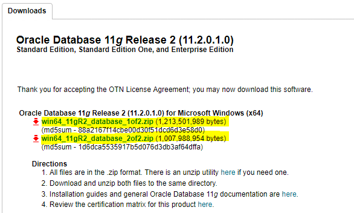
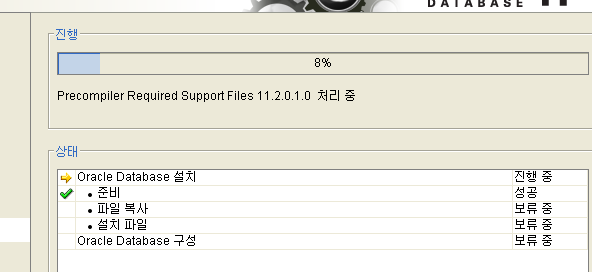

# OracleDatabaseJavaCRUD

# CRUD

## CRUD

## 프로젝트 구조
```command
├───src/
│   ├───DeleteServlet.java
│   ├───EditServlet.java
│   ├───EditServlet2.java
│   ├───Emp.java
│   ├───EmpDao.java
│   ├───SaveServlet.java
│   └───ViewServlet.java
├───WebContent/
│   ├───images/
│   │   └───delete.png
│   ├───META-INF/
│   │   └───MANIFEST.MF
│   ├───WEB-INF/
│   │   └───lib/
│   │       └───...
│   └───index.html
├───.classpath
└───.project
```
## 소스 분석
 > `Emp.java` : 
```java
public class Emp {
	
    private int id;
    private String name, password, email, country;

    public int getId()  {return id; }
    public String getName() { return name; }	
    public String getPassword() { return password; }
    public String getEmail() { return email; }
    public String getCountry() { return country; }

    public void setId(int id) { this.id = id; }
    public void setName(String name) { this.name = name; } 
    public void setPassword(String password) { this.password = password; }
    public void setEmail(String email) { this.email = email; }\
    public void setCountry(String country) { this.country = country; }
}
```
> `EmpDao.java`
```java
import java.sql.*;
```
> Connect OracleDB
```java
	public static Connection getConnection() {
		Connection con = null;
		try {
			Class.forName("oracle.jdbc.driver.OracleDriver");
			con = DriverManager.getConnection("jdbc:oracle:thin:@localhost:1521:orcl", "spring", "123123");
		} catch (Exception e) {
			System.out.println(e);
		}
		return con;
	}
```
> Create
```java
	public static int save(Emp e) {
		int status = 0;
		try {
			Connection con = EmpDao.getConnection();
			PreparedStatement ps = con.prepareStatement(
					"insert into user905(id, name,password,email,country) values (no_seq.nextval,?,?,?,?)");
			ps.setString(1, e.getName());
			ps.setString(2, e.getPassword());
			ps.setString(3, e.getEmail());
			ps.setString(4, e.getCountry());

			status = ps.executeUpdate();

			con.close();
		} catch (Exception ex) {
			ex.printStackTrace();
		}

		return status;
	}
```
> Read
```java
	public static Emp getEmployeeById(int id) {
		Emp e = new Emp();

		try {
			Connection con = EmpDao.getConnection();
			PreparedStatement ps = con.prepareStatement("select * from user905 where id=?");
			ps.setInt(1, id);
			ResultSet rs = ps.executeQuery();
			if (rs.next()) {
				e.setId(rs.getInt(1));
				e.setName(rs.getString(2));
				e.setPassword(rs.getString(3));
				e.setEmail(rs.getString(4));
				e.setCountry(rs.getString(5));
			}
			con.close();
		} catch (Exception ex) {
			ex.printStackTrace();
		}

		return e;
	}
```
```java
public static List<Emp> getAllEmployees() {
	List<Emp> list = new ArrayList<Emp>();

	try {
		Connection con = EmpDao.getConnection();
		PreparedStatement ps = con.prepareStatement("select * from user905");
		ResultSet rs = ps.executeQuery();	
        	while (rs.next()) {
			Emp e = new Emp();
			e.setId(rs.getInt(1));
			e.setName(rs.getString(2));
			e.setPassword(rs.getString(3));
			e.setEmail(rs.getString(4));
			e.setCountry(rs.getString(5));
			list.add(e);
		}
		con.close();
	} catch (Exception e) {
		e.printStackTrace();
	}
	return list;
}
```
> Update
```java
public static int update(Emp e) {
	int status = 0;
	try {
		Connection con = EmpDao.getConnection();
		PreparedStatement ps = con
				.prepareStatement("update user905 set name=?,password=?,email=?,country=? where id=?");
		ps.setString(1, e.getName());
		ps.setString(2, e.getPassword());
		ps.setString(3, e.getEmail());
		ps.setString(4, e.getCountry());
		ps.setInt(5, e.getId());

		status = ps.executeUpdate();

		con.close();
	} catch (Exception ex) {
		ex.printStackTrace();
	}

	return status;
}
```
> Delete
```java
public static int delete(int id) {
	int status = 0;
	try {
		Connection con = EmpDao.getConnection();
		PreparedStatement ps = con.prepareStatement("delete from user905 where id=?");
		ps.setInt(1, id);
		status = ps.executeUpdate();
			con.close();
	} catch (Exception e) {
		e.printStackTrace();
	}
		return status;
}
```
## Focus..
 - `prepareStatement` : `Statement`도 있기는 하지만 `PreparedStatement`는 한번 사용한 SQL문이저장되기 때문에 반복해서 사용할 경우 성능이 좋기 때문에 일반적으로는 PreparedStatement를 사용한다.
 - `DAO` : Data Access Object, 데이터 접근 객체.

## Oracle Database
#### install Oracle DB
 > 1. Signin Oracle
 
 > 2. Go to Link [ [OracleDB 11g Release download...](https://www.oracle.com/technetwork/database/enterprise-edition/downloads/112010-win64soft-094461.html) ]

 
 > 3. unzip in same `Folder` (folder name :  database)
 
 > 4. **관리자 권한으로 실행**
 
 > 5. [팝업] `[INS-13001]환경이 최소 요구 사항을 충족하지 않습니다 계속하겠습니까?` ▶ **예(Y)**
 
 > 6. [보안 갱신 구성] ▶ 입력 X ▶ **다음(N)** ▶ [팝업] ▶ **예(Y)**
 
 > 7. [설치 옵션] 데이터베이스 생성 및 구성(C) ▶ **다음(N)**
 
 > 8. [시스템 클래스] 서버 클래스(S) ▶ **다음(N)**
 
 > 9. [Grid 설치 옵션] 단일 인스턴스 데이터베이스 설치(S) ▶ **다음(N)** 
 
 > 10. [설치 유형] 표준 설치(I) ▶ **다음(N)**
 
 > 11. [기본 설치] 
  
  |전역 데이터베이스 이름(G)|관리 비밀번호(P)|비밀번호 확인(C)|
 |:---:|:---:|:---:|
 | orcl | !@#!% | !@#!% |
 
 ▶ [팝업] `[INS-13001]환경이 최소 요구 사항을 충족하지 않습니다 계속하겠습니까?` ▶ **예(Y)**

 > 12. [필요 조건 검사] skip...
 
 > 13. [요약] ▶ **완료(F)**

 >  14. [제품 설치] ▶ 

  

 [팝업] Database Configuration Assistant

 >  15. `scott`, `sh` 계정 설정
 
 >  16. [완료]

```command
Microsoft Windows [Version 10.0.18362.267]
(c) 2019 Microsoft Corporation. All rights reserved.

C:\Users\ ... >SQLPLUS

SQL*Plus: Release 11.2.0.1.0 Production on 월 8월 5 13:56:29 2019

Copyright (c) 1982, 2010, Oracle.  All rights reserved.

사용자명 입력: system
비밀번호 입력: !@#$!@#!

다음에 접속됨:
Oracle Database 11g Enterprise Edition Release 11.2.0.1.0 - 64bit Production
With the Partitioning, OLAP, Data Mining and Real Application Testing options

SQL>
```
## Servlet, Jsp
 - Servlet
   - Java 코드 안에 HTML 코드 (하나의 클래스)
   - data processing(Controller)에 좋다.
   - 즉 DB와의 통신, Business Logic 호출, 데이터를 읽고 확인하는 작업 등에 유용하다.
   - Servlet이 수정된 경우 Java 코드를 컴파일(.class 파일 생성)한 후 동적인 페이지를 처리하기 때문에    - 전체 코드를 업데이트하고 다시 컴파일한 후 재배포하는 작업이 필요하다. (개발 생산성 저하)
 - JSP
   - HTML 코드 안에 Java 코드
   - presentation(View)에 좋다.
   - 즉 요청 결과를 나타내는 HTML 작성하는데 유용하다.
   - JSP가 수정된 경우 재배포할 필요가 없이 WAS가 알아서 처리한다. (쉬운 배포)
   - Servlet과 JSP의 예시

